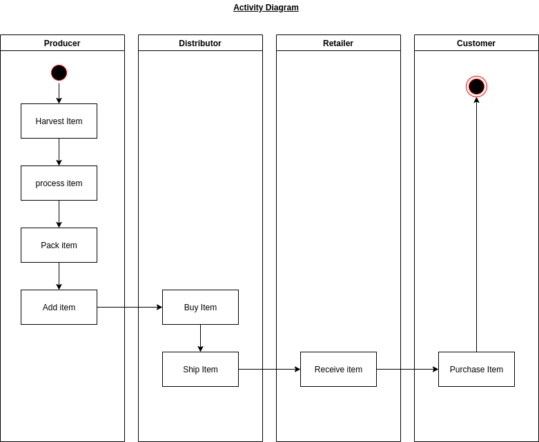
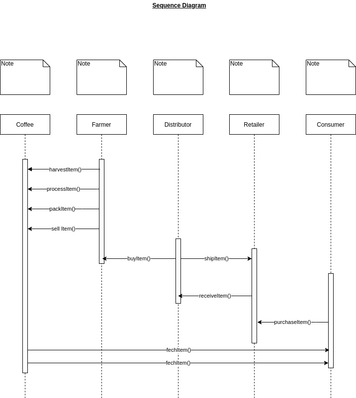
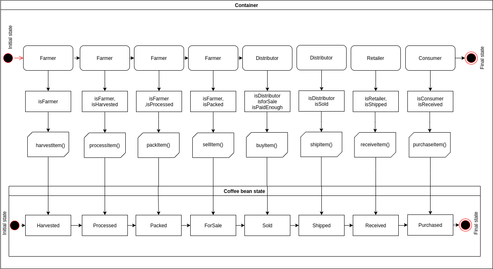
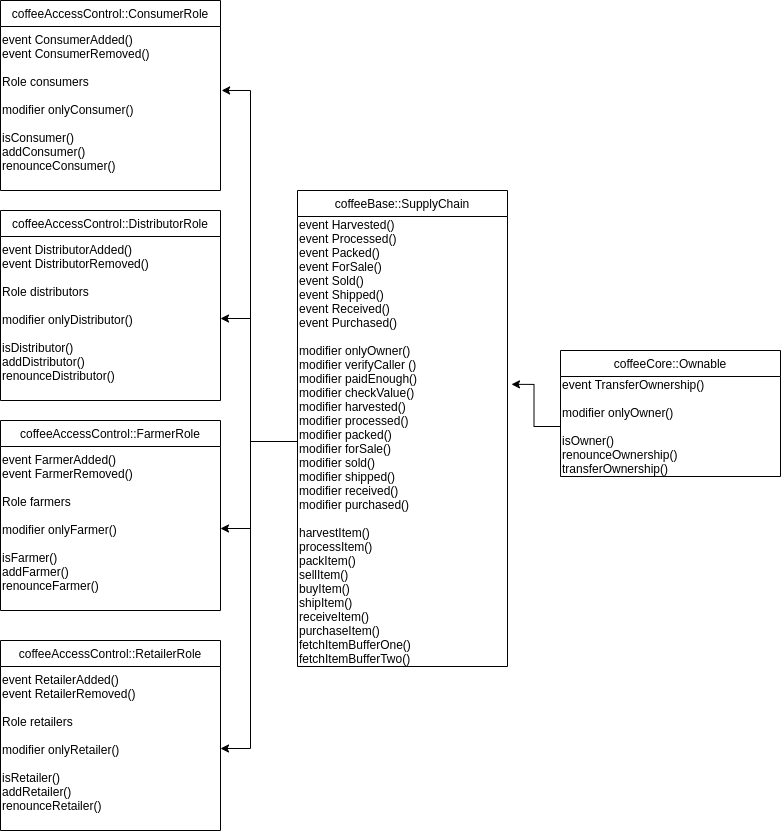

# nd1309-Project-6b

The contract address
If libraries were used, include why these libraries were adopted.

npm install truffle-assertions

to be able to use Truffle v5
as indicated in https://knowledge.udacity.com/questions/39124

If IPFS is used, include how IPFS is used in this project.

Program version numbers (This information will help your reviewer troubleshoot your project if any issues arise):

- Truffle v5.1.11 (core: 5.1.11)
- Solidity v0.5.16 (solc-js)
- Node v12.14.1
- Web3.js v1.2.1

## Project files

### UML documents:

Files located in uml folder.

#### Activity

#### Sequence

#### State

#### Class (Data Model)

